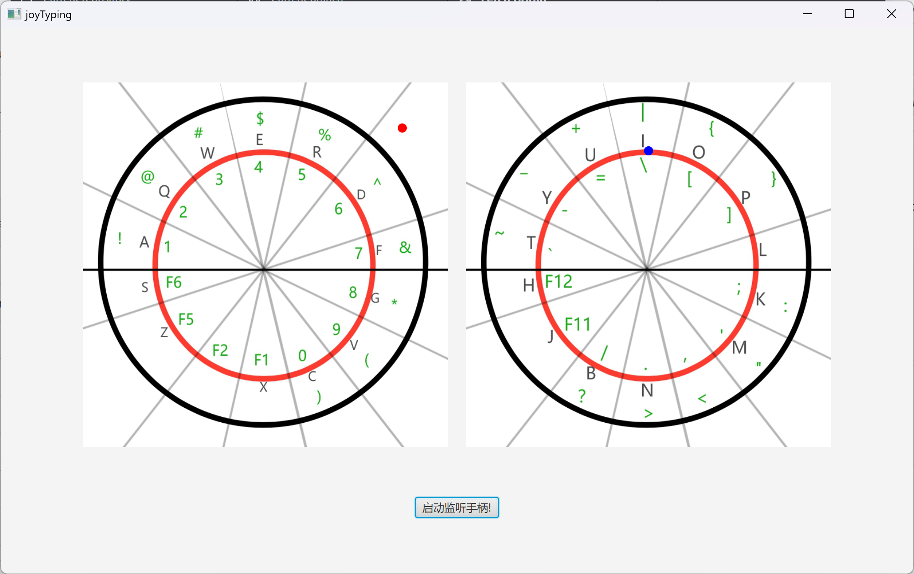
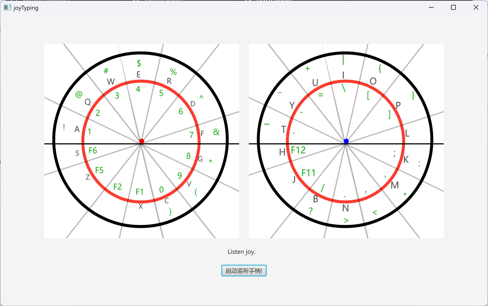
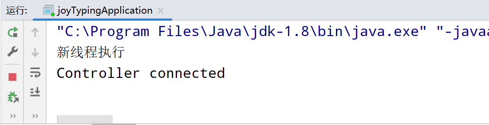
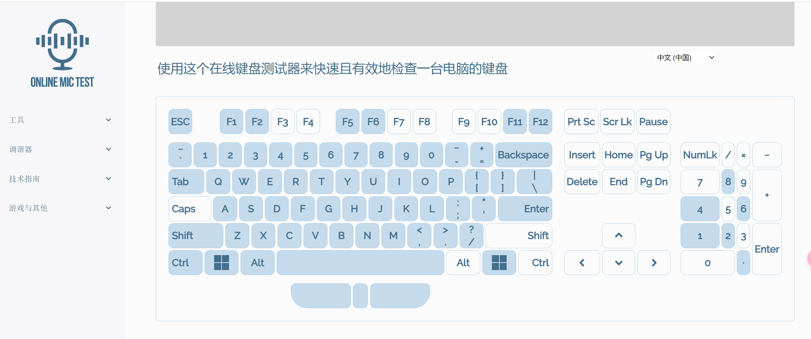

joytyping bata测试版本说明文档
=======
本项目是为了实现手柄打字（外加了控制鼠标移动的功能
）而创作的JavaFX桌面端应用程序，本软件仅能为微软Xbox的手柄提供支持软件。软件开发环境为JDK17，经测试在JDK8下也能正常运行。软件开发使用了 [JXInput](https://github.com/StrikerX3/JXInput)
项目库特此说明，JXInput需要以下两个[Visual C++ Redistributable Packages for Visual Studio 2017](https://support.microsoft.com/en-gb/help/2977003/the-latest-supported-visual-c-downloads)
才能运行请务必确认是否安装。

- [vc_redist.x86.exe](https://aka.ms/vs/15/release/vc_redist.x86.exe) (for 32-bit applications)
- [vc_redist.x64.exe](https://aka.ms/vs/15/release/vc_redist.x64.exe) (for 64-bit applications)

# 程序介绍

### 1、程序主界面

程序运行后出现以下窗口

点击监听手柄两个点将会移到中心

此时连接手柄控制台输出"Controller connected",此时移动左右摇杆左右点会跟随摇杆移动。

### 2、模拟键盘打字

将摇杆移到对应字母处可以向系统输入字母，左右摇杆按下后切换为绿色标的轮盘摇杆移入后输入对应符号或者功能键，手柄上的按钮分别对应不同的按键对应看下表。输入大写字母时需要轻微按下左板机键后再输入对应字母

| 手柄按键名称 |         对应键盘         |
|:------:|:--------------------:|
|   X    |         Tab          |
|   Y    |        Delete        |
|   A    |         Alt          |
|   B    |      Backspace       |
|  左边小键  |      切换模拟键盘还是鼠标      |
|  右边小键  |         End          |
|   LB   |         Ctrl         |
|   RB   |        space         |
|  左扳机键  |  轻微按下Shift,完全按下Esc   |
|  右扳机键  | 轻微按下切换模拟鼠标,完全按下Enter |
| 左摇杆按键  |        切换左轮盘         |
| 右摇杆按键  |        切换右轮盘         |
|  十字键上  |          上           |
|  十字键下  |          下           |
|  十字键左  |          左           |
|  十字键右  |          右           |

可模拟的按键在这里

### 3、模拟鼠标输入

按下西瓜键旁边的小键松开，此时手柄切换为鼠标输入左摇杆模拟滚轮右摇杆控制鼠标移动，左边肩键模拟鼠标左键右边肩键模拟鼠标右键。
若打字时需要短时移动鼠标，可稍微按下右扳机键并且保持，此时手柄为模拟鼠标状态可通过右摇杆移动鼠标。

### 4、会有程序图片加载不出来的情况

将img文件夹中left.jpg和right.jpg文件放到C盘的根目录下即可。